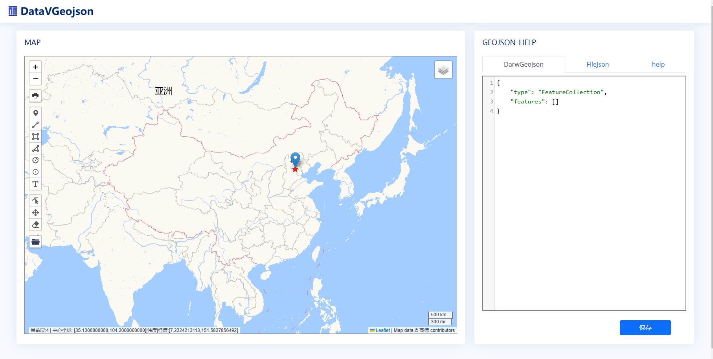
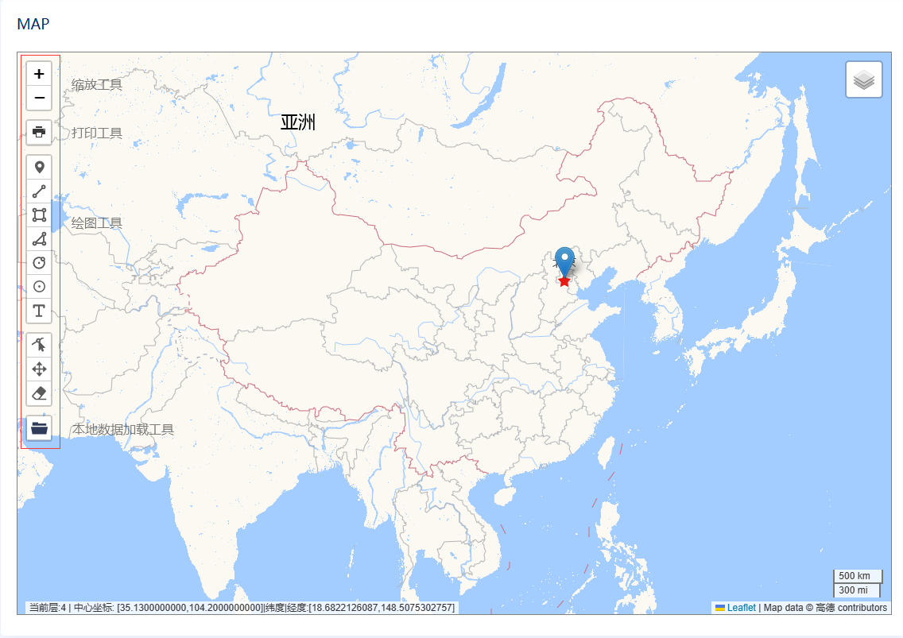
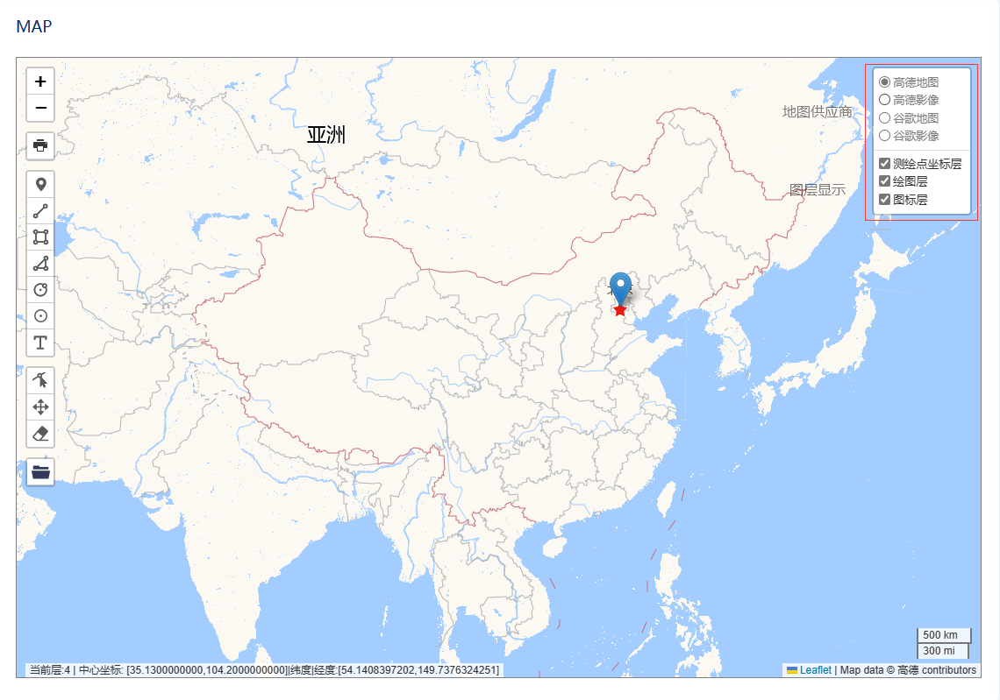
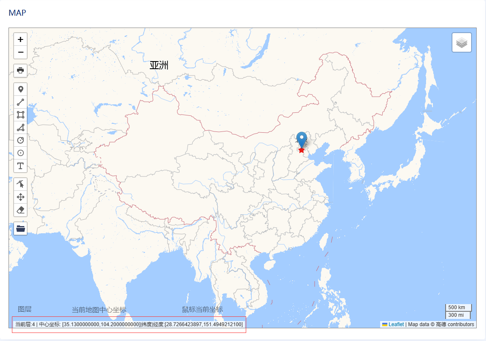
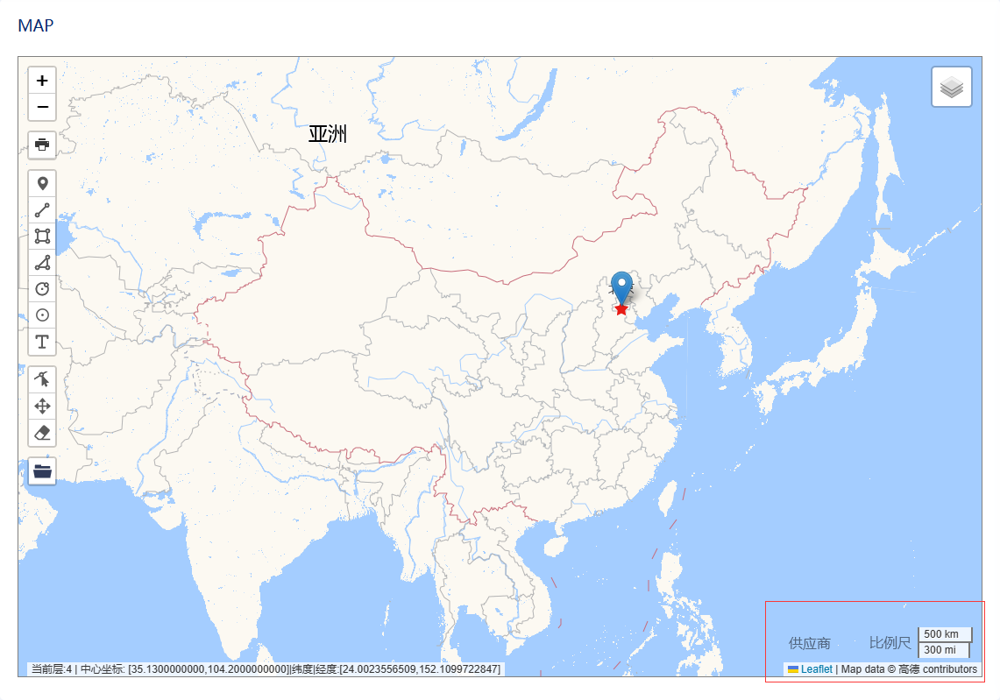
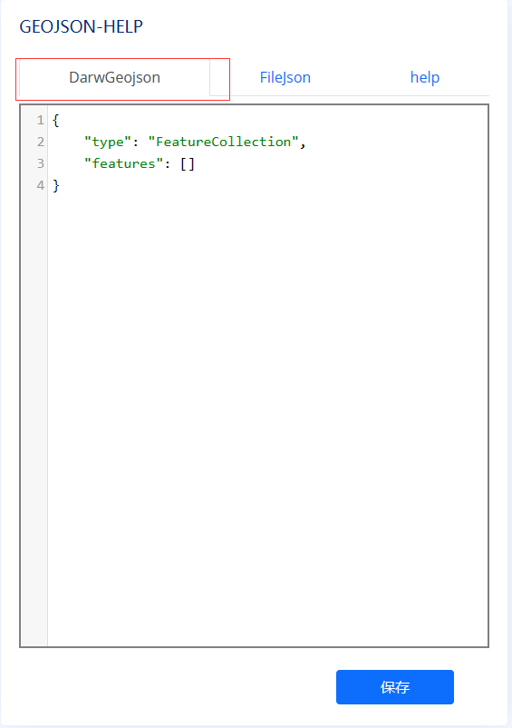
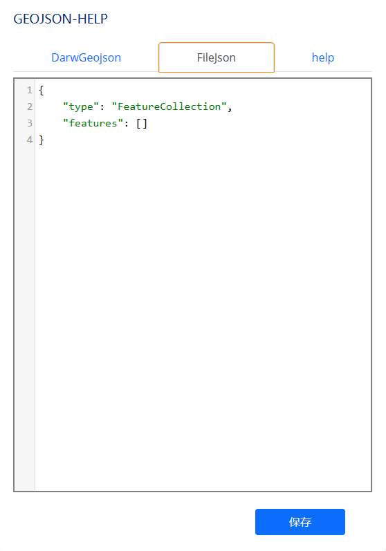
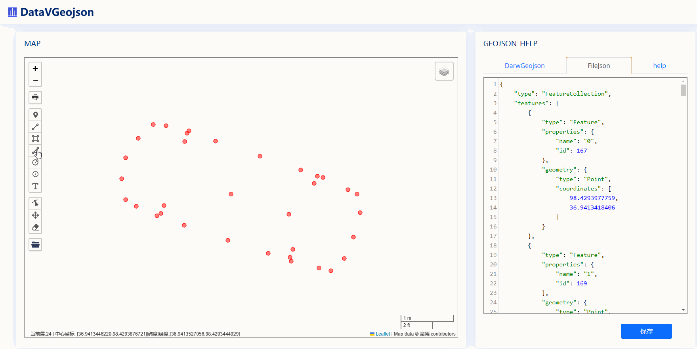
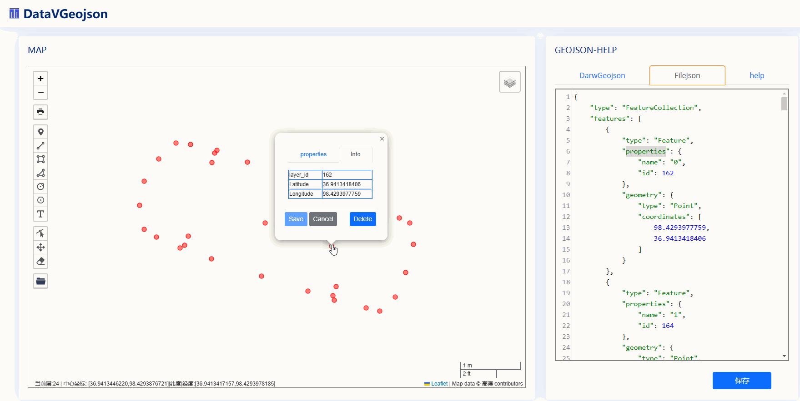
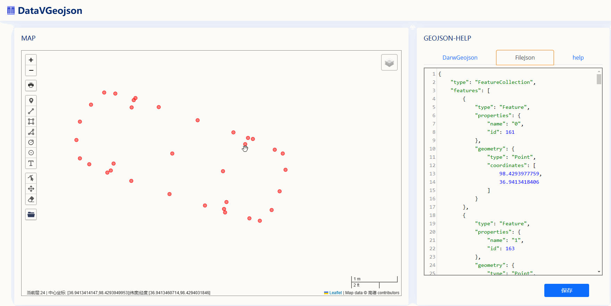

## DataVGeojson ##

* DataVGeojson 是基于[leaflet](https://leafletjs.com/reference.html#videooverlay) 与 [CodeMirror](https://codemirror.net/)的数据可视化绘图平台
* 是一种用于创建、查看和共享地图的快速、简单的工具。DataVGeojson以开源空间数据格式 [GeoJSON](https://geojson.org/)为标准，它可以导入 GeoJSON, KML、GPX、XLSX 格式的文件。
* DataVGeojson 是用于高精度地图绘图的平台，是高精度地图建模，与空间分析的简单的工具它可以用于厘米或毫米级的绘图。
* DataVGeojson 显示图层为32层。

## MAP 与 GEOJSON-HELP
DataVGeojson 分两部分:
* map
* Geojson-help
## MAP
### Left side of map  
* 左侧区域从上至下分别为地图缩放工具，打印工具,绘图工具，本地数据加载。

### Right side of map 
* 右侧区域为地图选项与图层选项。

### Bottom left of map 
* 地图底部左侧分别显示当前图层，地图当前中心坐标，鼠标当前坐标。

### Bottom right of map 
* 地图底部右侧分别显示当前比例尺，地图当前供应商。

## GEOJSON-HELP
### DrawGeojson 
* DrawGeojson 是绘图geojson显示区.当用户使用绘图工具在地图上绘图完成时，相应的在DrawGeojson的文本区域显示其Feature

### FileGeojson
* FileGeojson 是文件加载geojson显示区。当用户点击加载本地文件完成时，FileGeojson文本显示区会将用户的数据转换为标准的Geojson并显示。

* 可加载GeoJSON, KML、GPX、XLSX 格式的文件。
* XLSX文件要求纬度列在前经度列在后。原因leaflet加载marker的格式是纬度在前经度在后。加载过程中程序会将经纬度转换成标准geojson。
* 在谈论地理位置时，我们通常使用 Lat-long。这已编入[ISO 6709 标准](https://en.wikipedia.org/wiki/ISO_6709)。

### help
* help 是帮助文本，如果你有什么问题可查询help以得到所需信息。

## save
* 保存按钮可以保存当前显示区域的内容到本地磁盘。例如当前显示为DrawGeojson则保存DrawGeojson的内容。如果切换到FileGeojson则保存为FileGeojson的内容。
## 关于高亮显示
* 在加载文件时如果不想使用高亮显示可以在disDrawMap.js文件中control.loader.on('data:loaded', function (e) {}事件中将showHighlight设置为falsh
* 在右键上下文菜单中添加Cricle时如果你觉得高亮显示不是非常重要可以在disDrawMap.js文件中将addCricel方法中showHighlight设置为falsh.

## loadFile
* load XLSX 格式的文件
* XLSX文件要求纬度在前经度在后
* 加载的坐标会以CircleMarker

## draw point

## addPoint

## deletePoint

## deleteDraw

## addProperties

## distance

## 依赖
* 感谢[bootstrap](https://getbootstrap.com/).
* 感谢[NiceAdmin](https://bootstrapmade.com/).
* 感谢[CodeMirror](https://codemirror.net/).
* 感谢[leaflet](https://leafletjs.com/reference.html#videooverlay).
* 感谢[Leaflet-Geoman](https://github.com/geoman-io/leaflet-geoman).
* 感谢  htoooth 的高德,百度,天地图等地图的供应商. [Leaflet.ChineseTmsProviders](https://github.com/htoooth/Leaflet.ChineseTmsProviders).
* 感谢  changxin747 的高德,百度,天地图等地图的纠偏.[Leaflet.InternetMapCorrection](https://github.com/gisarmory/Leaflet.InternetMapCorrection).
* 感谢  brandonxiang 的Marker高亮.[leaflet.marker.highlight](https://github.com/brandonxiang/leaflet.marker.highlight).
* 感谢  Tom MacWright 的GPX 和 KML 文件转geojson [togeojson](https://github.com/placemark/togeojson).
* 感谢  Nikolay Kuchumov 的EXCEL文件的打开与输出.[read-excel-file](https://gitlab.com/catamphetamine/read-excel-file#json).
* 感谢  Adam Ratcliffe 的leaflet上下文菜单 [Leaflet.contextmenu](https://github.com/aratcliffe/Leaflet.contextmenu).
* 感谢  Jean-Etienne Castagnede 的打开本地文件GeoJSON、JSON、GPX、KML加载到地图中[Leaflet.FileLayer](https://github.com/makinacorpus/Leaflet.FileLayer).
* 感谢  Igor Vladyka 的地图打印插件[Map Print Plugin for Leaflet.js](https://github.com/Igor-Vladyka/leaflet.browser.print).
* 感谢  turf空间分析的JavaScript 库 [turf](https://github.com/Turfjs/turf).
*[Leaflet.RepeatedMarkers](https://gitlab.com/IvanSanchez/Leaflet.RepeatedMarkers)

